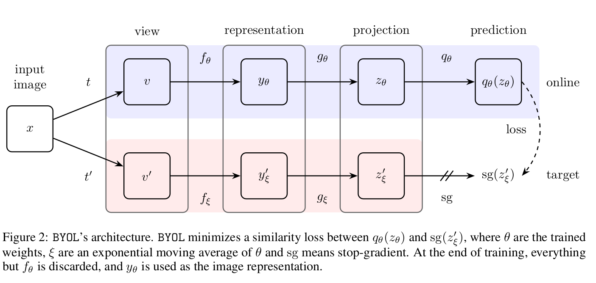
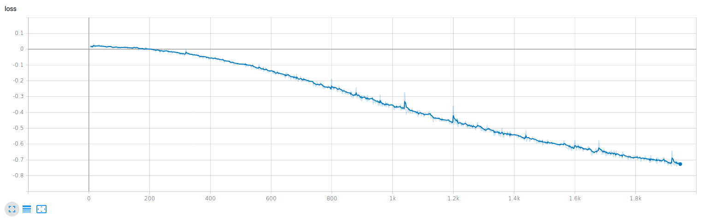

# Implementation of BYOL

Reference: https://arxiv.org/abs/2006.07733

Bootstrap Your Own Latent proposes a new self-supervised image representation learning approach. It uses pairs consisting of different views of the same image as data input.

## Architecture
The proposed learning approach uses an online network and a target network as shown below in order to generate two encodings of different views of the same image.


## Loss
The l2 loss is used to calculate and backpropagate gradients in only the online network whereas the target network uses an exponential moving average of gradients from the online network.

## Optimizer
The BYOL model is trained using the LARS optimizer.


After training, only the encoder of the online network is kept and a classifier can be trained over that encoder.

## Performance
The l2 loss function after 25 epochs on CIFAR10. The loss function for the BYOL model should further go down as we increase the ```epochs``` parameter. The `epochs` parameter is also responsible for scheduling the learning rate.

TODO:
- Train classifier on the online encoder.
- Evaluate the classifier accuracy on STL10.